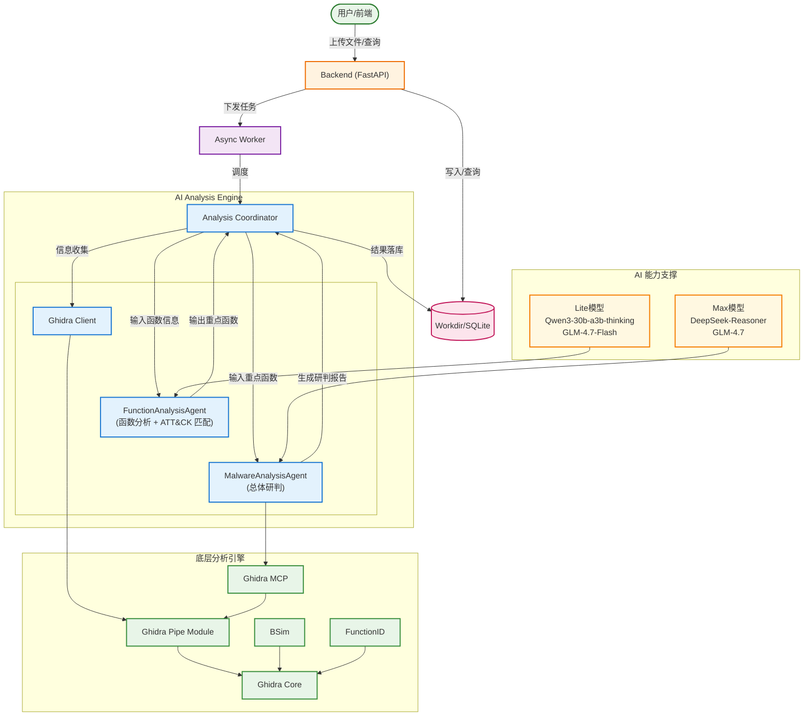

# Phantom TrojanWalker - AI 恶意软件自动化分析框架

Phantom TrojanWalker 是一个模块化的二进制分析与威胁检测平台，串联 Ghidra 静态分析、LLM 结构化研判与任务化后端，实现从样本上传到报告生成的自动化流水线。

## 🏗 系统架构



## 🧩 目录结构

```text
├── agents/             # AI 编排层（Coordinator / GhidraClient / Prompts）
├── backend/            # API + 任务系统 + SQLite
├── frontend/           # React 前端看板
├── module/             # ghidra_pipe + ghidra_mcp
├── data/               # 上传文件与任务数据
└── docker-compose.yml  # 一键启动
```

## ✅ 环境准备

- **Python**: 3.10+
- **Node.js**: 18+
- **Ghidra**: 12.0+（Docker 内置或本地安装）
- **JDK**: 21+

## ⚙️ 配置

1. 复制配置模板：

```bash
cd agents
cp config.yaml.example config.yaml
```

2. 编辑 `agents/config.yaml`，至少配置 LLM 与 Ghidra 地址：

```yaml
plugins:
  ghidra:
    base_url: "http://ph_ghidra:8000"
    endpoints:
      health_check: "/health_check"
      upload: "/upload"
      analyze: "/analyze"
      stop_analysis: "/stop_analysis"
      metadata: "/metadata"
      functions: "/functions"
      exports: "/exports"
      strings: "/strings"
      callgraph: "/callgraph"
      decompile: "/decompile"
      decompile_batch: "/decompile_batch"
      xrefs: "/xrefs"
      xrefs_batch: "/xrefs_batch"
  mcp:
    base_url: "http://ph_ghidra:9000/mcp"
    endpoints: {}

FunctionAnalysisAgent:
  system_prompt: ""
  system_prompt_path: "prompt/FunctionAnalysisAgent.md"
  llm:
    model_name: deepseek-reasoner
    temperature: 0  # 建议注释掉该参数使用模型提供商的默认值
    api_key: "YOUR_API_KEY_HERE"
    base_url: "https://api.deepseek.com/chat/completions"
    extra_body: {}
    max_retries: 3
    timeout: 120
    streaming: true
    max_completion_tokens: 32768
    max_input_tokens: 131072
  rate_limit:
    requests_per_second: 10
    check_every_n_seconds: 0.1
    max_bucket_size: 10

MalwareAnalysisAgent:
  system_prompt: ""
  system_prompt_path: "prompt/MalwareAnalysisAgent.md"
  llm:
    model_name: deepseek-reasoner
    temperature: 0  # 建议注释掉该参数使用模型提供商的默认值
    api_key: "YOUR_API_KEY_HERE"
    base_url: "https://api.deepseek.com/chat/completions"
    extra_body: {}
    max_retries: 3
    timeout: 600
    streaming: true
    max_completion_tokens: 32768
    max_input_tokens: 131072
  rate_limit:
    requests_per_second: 10
    check_every_n_seconds: 0.1
    max_bucket_size: 10
  tool_budget:
    enabled: true
    max_tool_calls: 12
    max_agent_steps: 30
    max_tool_result_chars: 120000


```

提示：修改 prompt 或 config 后，需要重启 backend/worker 生效。

## 🚀 快速启动

### 方式 A：Docker Compose（推荐）

```bash
docker compose up --build
```

默认端口：Ghidra `127.0.0.1:8000`、Backend `127.0.0.1:8001`（`/api`）、Frontend `127.0.0.1:8080`、Ghidra MCP `127.0.0.1:9000`。

### 方式 B：纯本地（开发调试）

按顺序启动：

```bash
# Step 1: Ghidra 引擎
export GHIDRA_INSTALL_DIR=/path/to/ghidra
python module/ghidra_pipe/main.py

# Step 2: Backend + Worker
python backend/main.py

# Step 3: Frontend
cd frontend
npm install
npm run dev
```

访问：`http://localhost:5173`

## 🔧 常用环境变量

- `PTW_GHIDRA_BASE_URL`：覆盖 `agents/config.yaml` 中的 `plugins.ghidra.base_url`
- `PTW_MCP_BASE_URL`：覆盖 MCP 地址
- `PTW_MAX_UPLOAD_BYTES`：最大上传大小（默认 200MB）
- `PTW_CORS_ORIGINS`：后端允许的跨域来源（逗号分隔）
- `BACKEND_HOST` / `BACKEND_PORT`：后端监听地址与端口
- `GHIDRA_INSTALL_DIR`：本地 Ghidra 安装目录
- `PHANTOM_DEBUG`：设为 `true` 后启用 `MalwareAnalysisAgent` 抓包式调试日志（完整原始请求/响应会写入 `data/logs/malware_agent_debug.log`）
- `LANGFUSE_SECRET_KEY` / `LANGFUSE_PUBLIC_KEY` / `LANGFUSE_BASE_URL`：启用 Langfuse 可观测（LangChain 回调模式）

### Langfuse 可观测（LangChain）

按 Langfuse 官方 LangChain 集成方式，本项目会在 LLM 调用时自动挂载 `langfuse.langchain.CallbackHandler`。

在项目根目录创建 `.env`（或导出同名环境变量）：

```bash
LANGFUSE_SECRET_KEY="sk-lf-..."
LANGFUSE_PUBLIC_KEY="pk-lf-..."
LANGFUSE_BASE_URL="http://localhost:3000"
```

Docker 方式重启：

```bash
docker compose up --build -d
```

说明：
- 未设置上述变量时，会自动跳过 Langfuse（不影响原有分析流程）。
- 仅需配置 backend/worker 进程环境变量，frontend 与 ghidra 服务无需配置。

## 🧷 常见问题

- **前端一直 pending**：这是正常队列等待，系统只允许单并发分析。
- **LLM 解析失败**：LLM 必须返回 JSON object，确认模型/网关支持 `response_format`。
- **Ghidra 无法启动**：检查 `GHIDRA_INSTALL_DIR` 与 JDK 版本。

## ⚖️ 法律声明

本项目仅供安全研究与教学使用。使用者需确保在法律允许范围内使用该工具。

---

## 以上内容为人机生成，以下内容才是真人写的

我自己搭了一个站点大家可以测试：https://phantom.num123.top/

不要传加壳程序，不要传msi，不要传无关文件，更不要传函数特别多的程序

ollvm分析不了是ghidra的问题，某些样本栈不平衡也会干扰ghidra

安装包分析结果不准确，没有分析的必要

机器性能很弱，ghidra容器只分配了1个cpu核心，所以不要传很复杂的程序分析，差不到历史记录说明机器炸了

这是一个示例：478eb07375f1513160ad5e80dff2c03f93707d414c4e13e1d7826067b8c9cf3c


最好还是自己部署，部署很方便，首先把config.yaml当中的设置填好，然后直接docker compose就行

ghidra会吃1GB左右的内存，部署的机器配置不要太低了，最好限制一下ghidra容器的CPU核心数量，否则可能会把整个机器卡死

仓库和代码都有一点乱，但是配套了copilot-instructions.md和AGENTS.md，有代码相关的问题可以直接问copilot

FunctionAnalysisAgent可以使用小模型，我用的mistral-medium + nemotron-3-nano-30b-a3b + LongCat-Flash-Lite，因为它们是免费的

不要使用太小的模型例如qwen3-4b-thinking-2507，知识太少只能理解代码的功能，不能做att&ck矩阵匹配

MalwareAnalysisAgent尽可能使用先进的模型，该agent涉及到工具调用，我使用LongCat-Flash-Thinking-2601，因为它每天送我500万tokens，并且这个模型支持一边思考一边调工具

项目还有很多优化空间，特别是提示词这块，MalwareAnalysisAgent调用工具很不积极

有问题可以提issue，有bug问copilot吧，你给我说了bug我也只会问copilot

## 局限性

真实环境中的样本往往存在大量函数需要分析，调用API非常耗费tokens，这部分我希望能够通过本地部署的小模型解决。我实测一个4b的小模型能够准确分析出代码的行为，但是由于知识量太少，做att&ck矩阵匹配比较困难。

其实逐函数分析agent的首要任务是分析代码行为，至于为什么要匹配att&ck矩阵纯粹是为了给agent一个清晰的界限，划分出哪些函数存在恶意行为需要重点关注，哪些函数没有分析的价值不需要再传递给后续的agent。至于最终匹配到的ttp精确与否完全不重要，模型只需要知道这个函数“很关键”即可。当然了，如果有精确匹配ttp的需求，大可以使用capa之类的工具按照规则去匹配。

这就像我们人工分析一个样本的流程一样，需要找到一个切入点，然后深入地挖掘，这个切入点是用什么工具或方法找出来的完全不重要。

我会尝试微调一个小模型，看看能不能让它学习到att&ck相关的知识。

另外项目还有一个缺陷就是库函数的识别，ghidra自带的bsim和fid功能很强大，但是网上的公开识别库非常少。强化库函数识别的能力，可以极大地减轻逐函数分析agent的压力。

腾讯binaryai做了库函数识别的研究，后续我也会进一步探索与尝试。

## 🔗 参考资料

- [基于大模型的病毒木马文件云鉴定](https://mp.weixin.qq.com/s/G6LyMtzMxtwk5uAMo44euQ)
- [二进制安全新风向：AI大语言模型协助未知威胁检测与逆向分析](https://www.huorong.cn/document/info/classroom/1887)

